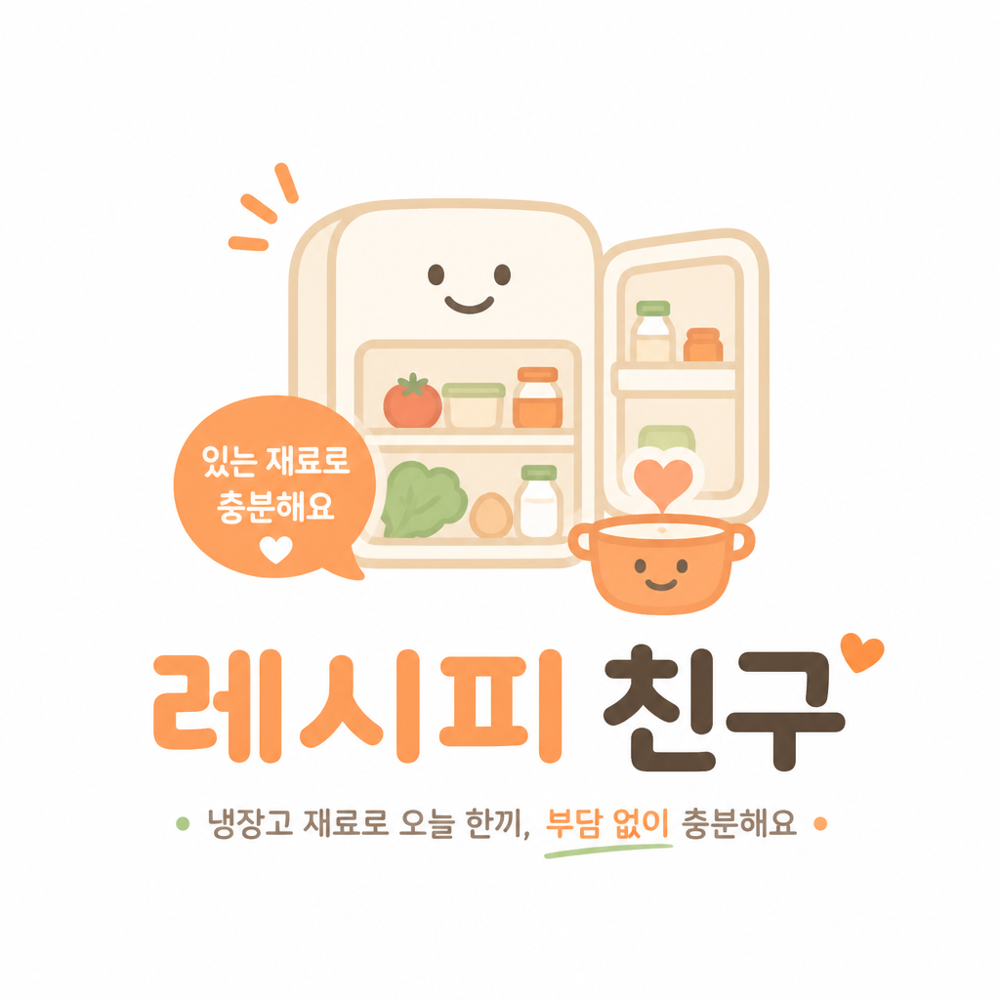
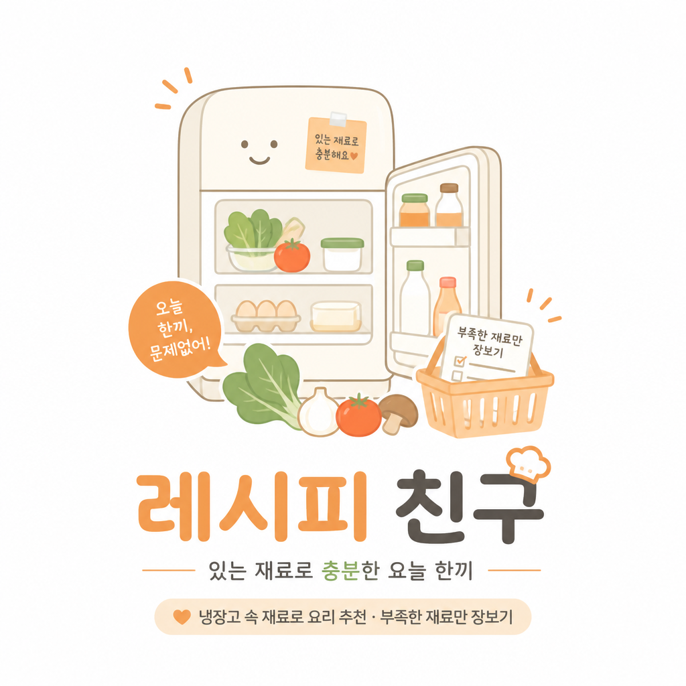
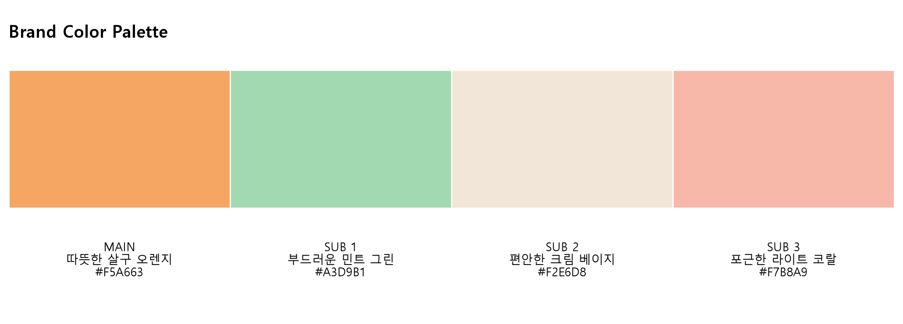

# A2-1 브랜드 아이덴티티 생성기

> 냉장고 속 재료로 오늘의 한 끼를 제안하는 푸드테크 서비스를 위한 AI 브랜드 제작 프로젝트


브랜드 브리프 하나를 입력하면 AI가 브랜드명, 슬로건, 스토리, 컬러 팔레트와 로고 시안을 순서대로 생성합니다. 팀원이 나누어 만든 기능을 `main.py` 하나에 통합해 전체 과정을 한 번에 실행할 수 있습니다.

## 결과 미리보기

| 로고 시안 1 | 로고 시안 2 |
|---|---|
|  |  |

### 브랜드 컬러 팔레트



## 주요 기능

- 브랜드명 후보 3~5개와 의미 생성
- 브랜드 톤에 맞는 슬로건 3개 생성
- 탄생 배경과 철학을 담은 브랜드 스토리 생성
- 메인 컬러 1개와 서브 컬러 2~3개 추천
- 컬러 팔레트 PNG 자동 제작
- 서로 다른 방향의 로고 시안 2개 생성
- 모든 결과를 `brand_result.json`으로 통합 저장

## 동작 흐름

```text
brief.json
    ↓
브랜드 네이밍과 슬로건
    ↓
브랜드 스토리
    ↓
컬러 팔레트
    ↓
로고 시안 2개
    ↓
output/brand_result.json + PNG 결과물
```

## 프로젝트 위치

```text
A2-1/
├── main.py                 # 모든 기능을 합친 최종 실행 파일
├── Naming.py               # 네이밍·슬로건 담당 원본
├── content.py              # 브랜드 스토리 담당 원본
├── visual.py               # 컬러·로고 담당 원본
├── brief.json              # 브랜드 입력 정보
├── .env.example            # 환경변수 작성 예시
├── requirements.txt        # 필요한 파이썬 패키지
└── output/
    ├── brand_result.json
    ├── brand_color_palette_ko.png
    ├── color_palette.png
    ├── logo_01.png
    └── logo_02.png
```

## 시작하기

### 1. 저장소 복제

```bash
git clone https://github.com/Frost0313z/A2-1.git
cd A2-1
```

### 2. 가상환경 생성 및 활성화

Windows PowerShell:

```powershell
python -m venv venv
venv\Scripts\Activate.ps1
```

macOS 또는 Linux:

```bash
python3 -m venv venv
source venv/bin/activate
```

### 3. 패키지 설치

```bash
pip install -r requirements.txt
```

### 4. API 키 설정

`.env.example`을 복사해 `.env` 파일을 만들고 본인의 API 키를 입력합니다.

```env
OPENAI_API_KEY=여기에_본인의_API_키_입력

OPENAI_MODEL=gpt-4o-mini
OPENAI_TEXT_MODEL=gpt-4.1-mini
OPENAI_IMAGE_MODEL=gpt-image-2
```

> `.env`에는 비밀 API 키가 들어갑니다. GitHub, 메신저, 이메일 등에 공유하지 마세요.

### 5. 브랜드 정보 작성

`brief.json`에서 다음 정보를 원하는 브랜드에 맞게 수정합니다.

```json
{
  "industry": "브랜드 업종",
  "target": "주요 고객",
  "keywords": ["핵심", "키워드"],
  "tone": "브랜드가 말하는 분위기",
  "description": "서비스 설명"
}
```

### 6. 실행

```bash
python main.py
```

실행이 끝나면 `output` 폴더에서 JSON 결과와 PNG 이미지를 확인할 수 있습니다. 이미지 생성 API를 사용하므로 실행 시 API 사용량이 발생할 수 있습니다.

## 파트별 담당자

브랜드의 업종, 타겟, 핵심 키워드와 톤앤매너를 담은 브랜드 브리프는 팀원 모두가 함께 논의하여 확정했습니다.

| 영역 | 담당자 | 담당 업무 | 관련 파일 |
|---|---|---|---|
| 브랜드 브리프 | 팀원 전원 | 브랜드 방향 논의 및 입력 정보 확정 | `brief.json` |
| 통합·입력 | 두승현(팀장) | 브리프 입력, 전체 코드 통합, 실행 흐름 연결 및 결과 저장 | `main.py` |
| 네이밍 | 김만복 님 | 브랜드명 후보와 슬로건 생성 | `Naming.py` |
| 스토리·컬러 | 강진아 님 | 브랜드 스토리와 컬러 콘텐츠 구성 | `content.py` |
| 비주얼 | 이인규 님 | 컬러 팔레트 시각화와 로고 시안 생성 | `visual.py` |

## 작업 로그

| 단계 | 담당자 | 수행 작업 | 결과 및 수정 내용 |
|---|---|---|---|
| 브랜드 브리프 작성 | 팀원 전원 | 업종, 타겟, 키워드와 톤앤매너 논의 | `기술이 아니라 안심을 판다`를 핵심 방향으로 정하고 `brief.json` 작성 |
| 통합·입력 | 두승현(팀장) | 각 파트 코드 통합 및 전체 실행 구조 구성 | 함수별 입력값이 달라 발생한 연결 문제를 수정하고 `main.py` 하나로 통합 |
| 네이밍 | 김만복 님 | 브랜드명 후보 3~5개와 슬로건 3개 생성 | 후보 중 친근한 인상을 주는 `레시피 친구`를 대표 결과로 사용 |
| 스토리·컬러 | 강진아 님 | 브랜드 스토리와 컬러 방향 생성 | 자취생에게 위로를 전하는 이야기와 따뜻하고 편안한 컬러 구성 제안 |
| 비주얼 | 이인규 님 | 컬러 팔레트와 로고 시안 제작 | 로고 2개 생성 및 한글 폰트가 깨지는 문제 확인 |
| 통합 테스트 | 팀원 전원 | 브리프 입력부터 결과 저장까지 전체 실행 | JSON, 컬러 팔레트와 로고 이미지가 모두 생성되는 것을 확인 |

### 핵심 프롬프트

#### 네이밍·슬로건

```text
브랜드 브리프를 참고해 브랜드명 후보 3~5개를 제안해줘.
각 후보는 브랜드명과 의미를 포함하고 JSON 형식으로 출력해줘.
브랜드의 톤앤매너를 반영한 슬로건 3개도 JSON 배열로 제안해줘.
```

#### 브랜드 스토리

```text
푸드테크 브랜드 전문 카피라이터로서 브랜드의 탄생 배경과 철학을 담은
200~300자 분량의 감성적인 스토리를 작성해줘.
요리 경험이 적은 자취생의 공감을 이끌고 다정하고 편한 톤을 사용해줘.
```

#### 컬러 팔레트

```text
브랜드 브리프를 바탕으로 메인 컬러 1개와 서브 컬러 2~3개를 추천해줘.
차갑고 기술적인 느낌보다 음식, 생활, 안심과 자취 감성을 고려하고
각 컬러의 이름과 HEX 코드를 JSON 형식으로 출력해줘.
```

#### 로고 시안

```text
냉장고 속 재료로 한 끼를 만드는 푸드테크 서비스의 로고를 생성해줘.
따뜻하고 다정한 분위기와 추천 컬러 팔레트를 반영하고,
웹과 앱에서 사용할 수 있는 부드럽고 단순한 형태로 만들어줘.
```

### 오류 및 수정 이력

| 문제 | 원인 | 해결 내용 |
|---|---|---|
| `Naming.py` 임포트 오류 | 파일이 자기 자신을 다시 불러오는 구조 | 공통 AI 호출 기능을 통합 파일에서 사용하도록 연결 구조 수정 |
| 모듈별 함수 호출 오류 | `content.py`와 `visual.py`의 함수 인자 규격이 서로 다름 | `main.py`에서 브랜드명, 컬러, 클라이언트와 저장 경로를 정확히 전달 |
| 필수 패키지 누락 | `python-dotenv`, `matplotlib`이 설치되지 않음 | 필요한 패키지를 설치하고 `requirements.txt`에 기록 |
| 컬러 팔레트 한글 깨짐 | Matplotlib 기본 폰트가 한글을 지원하지 않음 | Windows의 `Malgun Gothic` 폰트를 지정하고 팔레트 이미지 재생성 |
| README 이미지 미표시 | 한글 중첩 폴더와 이미지 캐시 문제 | 프로젝트 파일을 저장소 최상단으로 이동하고 이미지 경로 갱신 |
| API 키 공유 위험 | `.env`에 실제 비밀 키가 저장됨 | `.env`는 Git에서 제외하고 `.env.example`만 공유 |

## 주요 의사결정

### 1. 브랜드 포지셔닝

- **결정:** AI 기술보다 사용자가 느끼는 안심을 강조한다.
- **이유:** 요리 경험이 적은 자취생에게는 기술 설명보다 `있는 재료로도 충분하다`는 메시지가 더 중요하기 때문이다.
- **반영:** 브리프, 스토리와 로고 프롬프트에 따뜻함, 편안함, 부담 없음이라는 표현을 적용했다.

### 2. 핵심 타겟

- **결정:** 요리 경험이 적고 장보기와 재료 관리의 부담을 줄이고 싶은 자취 1인 가구를 핵심 타겟으로 정했다.
- **이유:** 냉장고 재료 관리와 장보기 과정에서 가장 큰 불편을 겪는 사용자이기 때문이다.
- **반영:** 네이밍과 슬로건에 냉장고, 한 끼, 충분함과 같은 생활 밀착형 표현을 사용했다.

### 3. 대표 브랜드명

- **결정:** 생성된 후보 중 `레시피 친구`를 대표 브랜드명으로 사용했다.
- **이유:** 어렵거나 기술적인 느낌 없이 자취생을 옆에서 도와주는 친근한 서비스 이미지를 전달하기 때문이다.
- **반영:** 브랜드 스토리와 로고 이미지 생성에 해당 이름을 사용했다.

### 4. 컬러와 비주얼 방향

- **결정:** 따뜻한 살구색을 메인으로 사용하고 민트, 크림과 코랄 계열을 보조 색으로 구성했다.
- **이유:** 차가운 기술 서비스보다 음식, 생활과 안심의 분위기를 전달하기 적합하기 때문이다.
- **반영:** 컬러 팔레트 이미지와 두 개의 로고 시안에 추천 색상을 적용했다.

### 5. 코드 통합 방식

- **결정:** 역할별 원본 코드는 보존하고 최종 실행 코드는 `main.py` 하나로 통합했다.
- **이유:** 팀원별 작업 내용을 확인하면서도 사용자는 파일 하나만 실행할 수 있게 하기 위해서다.
- **반영:** `Naming.py`, `content.py`, `visual.py`와 통합된 `main.py`를 함께 제공했다.

### 6. API 키 보안

- **결정:** 실제 `.env`는 공유하지 않고 `.env.example`만 저장소에 제공한다.
- **이유:** 공개 저장소를 통한 API 키 유출과 무단 사용을 막기 위해서다.
- **반영:** `.gitignore`에 `.env`를 등록하고 팀원별 API 키 설정 방법을 안내했다.

## 현재 테스트 결과

- 전체 파이프라인 정상 종료
- 브랜드명 후보 5개 및 슬로건 3개 생성 확인
- 브랜드 스토리와 컬러 데이터 생성 확인
- 컬러 팔레트 및 로고 PNG 2개 생성 확인
- 최종 `brand_result.json` 저장 확인

## 보안 안내

- 실제 `.env` 파일은 `.gitignore`로 제외되어 있습니다.
- 팀원은 각자 발급받은 API 키를 사용해야 합니다.
- 공개된 키가 있다면 즉시 폐기하고 새 키를 발급하세요.

---

코디세이 AI Native Advanced · Term Project A
